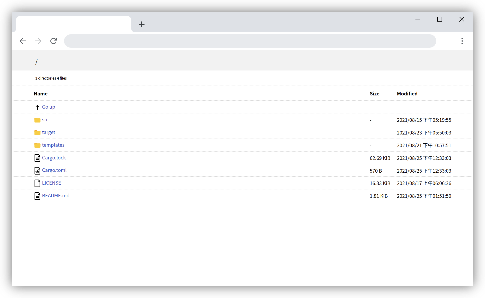

# Srv Dev Server

This is a simple HTTP Server for use in a development environment, inspired by [simple-http-server](https://github.com/TheWaWaR/simple-http-server) and [caddy2](https://github.com/caddyserver/caddy), and it is also a practice project for me to learn rust.

### Screenshot

### Built With

- ~~[rocket](https://github.com/SergioBenitez/Rocket)~~ Framework used in previous versions
- [clap](https://github.com/clap-rs/clap) Provide command line parameter analysis
- [tera](https://github.com/Keats/tera) Provide template support
- [actix-web](https://github.com/actix/actix-web) Main frame
- [actix-files](https://github.com/actix/actix-web/tree/master/actix-files) Provide static resources
- [actix-web-httpauth](https://github.com/actix/actix-extras/tree/master/actix-web-httpauth) Provide authentication
- [rustls](https://github.com/rustls/rustls) Provide TLS and HTTP/2 support
- [env_logger](https://github.com/env-logger-rs/env_logger) Provide log output

## Features

- Automatic generation of directory listings (default enabled)
- Relative path/absolute path/support
- Brotli/Gzip/Deflate streaming compression support (default disabled, disables Content-length and segmented downloads when enabled)
- Control whether dotfiles are displayed and can be accessed (default disabled)
- HTTP cache support, 304 support, Last-Modified/ETag support, of course you can also turn off cache
- Clearly colored organized log
- Disable access logging or disable all logging support
- Automatically open default browser (default disabled)
- Single-Page Application mode (always serve /index.html when the file is not found)
- Custom listening address (default 0.0.0.0) Custom listening port number (default 8000)
- HTTP Basic Authentication Support
- TLS/SSL support, HTTP/2 support
- One click to enable CORS, custom CORS header support
- cargo doc support